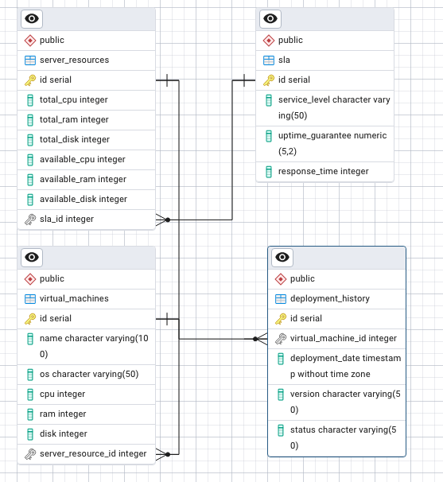

# Schemat bazy danych

## Diagram ERD

## Tabele

### Tabela: `sla`
- **Opis:** Przechowuje informacje o poziomach SLA (Service Level Agreement).
- **Kolumny:**
  - `id` *(serial, PRIMARY KEY)* – unikalny identyfikator SLA.
  - `service_level` *(VARCHAR(50), NOT NULL)* – nazwa poziomu SLA (np. Gold, Silver, Bronze).
  - `uptime_guarantee` *(DECIMAL(5,2), NOT NULL)* – gwarantowany czas działania w procentach (np. 99.99).
  - `response_time` *(INT, NOT NULL)* – gwarantowany czas reakcji w minutach.

---

### Tabela: `server_resources`
- **Opis:** Przechowuje informacje o zasobach serwerowych.
- **Kolumny:**
  - `id` *(serial, PRIMARY KEY)* – unikalny identyfikator serwera.
  - `total_cpu` *(INT, NOT NULL)* – całkowita liczba rdzeni procesora na serwerze.
  - `available_cpu` *(INT, NOT NULL)* – liczba dostępnych rdzeni procesora.
  - `total_ram` *(INT, NOT NULL)* – całkowita ilość pamięci RAM w GB.
  - `available_ram` *(INT, NOT NULL)* – dostępna ilość pamięci RAM w GB.
  - `total_disk` *(INT, NOT NULL)* – całkowita pojemność dysku w GB.
  - `available_disk` *(INT, NOT NULL)* – dostępna pojemność dysku w GB.
  - `sla_id` *(INT, FOREIGN KEY REFERENCES `sla(id)`)* – poziom SLA przypisany do serwera.

---

### Tabela: `virtual_machines`
- **Opis:** Przechowuje informacje o maszynach wirtualnych.
- **Kolumny:**
  - `id` *(serial, PRIMARY KEY)* – unikalny identyfikator maszyny wirtualnej.
  - `name` *(VARCHAR(100), NOT NULL)* – nazwa maszyny.
  - `os` *(VARCHAR(50))* – system operacyjny maszyny (np. Ubuntu, Windows).
  - `cpu` *(INT, NOT NULL)* – liczba przydzielonych rdzeni procesora.
  - `ram` *(INT, NOT NULL)* – przydzielona ilość pamięci RAM w GB.
  - `disk` *(INT, NOT NULL)* – przydzielona pojemność dysku w GB.
  - `server_resource_id` *(INT, FOREIGN KEY REFERENCES `server_resources(id)` ON DELETE CASCADE)* – serwer, na którym działa maszyna wirtualna.

---

### Tabela: `deployment_history`
- **Opis:** Przechowuje historię wdrożeń dla maszyn wirtualnych.
- **Kolumny:**
  - `id` *(serial, PRIMARY KEY)* – unikalny identyfikator wdrożenia.
  - `virtual_machine_id` *(INT, FOREIGN KEY REFERENCES `virtual_machines(id)` ON DELETE CASCADE)* – odniesienie do maszyny wirtualnej.
  - `deployment_date` *(TIMESTAMP, DEFAULT NOW())* – data i czas wdrożenia.
  - `version` *(VARCHAR(50), NOT NULL)* – wersja wdrożonego oprogramowania.
  - `status` *(VARCHAR(50), CHECK (status IN ('success', 'failure')))* – status wdrożenia (np. success, failure).

---

## Relacje między tabelami

### 1. Relacja `server_resources` -> `sla`
- Każdy serwer (`server_resources`) ma przypisany jeden poziom SLA (`sla`).
- Relacja typu N:1 (wiele serwerów, jeden poziom SLA).
- Kolumna `sla_id` w tabeli `server_resources` odnosi się do `id` w tabeli `sla`.

### 2. Relacja `server_resources` -> `virtual_machines`
- Każdy serwer (`server_resources`) może być powiązany z wieloma maszynami wirtualnymi (`virtual_machines`).
- Relacja typu 1:N (jeden serwer, wiele maszyn).
- Kolumna `server_resource_id` w tabeli `virtual_machines` odnosi się do `id` w tabeli `server_resources`.

### 3. Relacja `virtual_machines` -> `deployment_history`
- Każda maszyna wirtualna (`virtual_machines`) może mieć wiele wpisów w historii wdrożeń (`deployment_history`).
- Relacja typu 1:N (jedna maszyna, wiele wdrożeń).
- Kolumna `virtual_machine_id` w tabeli `deployment_history` odnosi się do `id` w tabeli `virtual_machines`.

---

## Dodatkowe informacje

- **Klucze główne i obce:**
    - Każda tabela ma zdefiniowany klucz główny (`id`).
    - Klucze obce (`server_resource_id`, `virtual_machine_id`, `sla_id`) zapewniają integralność referencyjną między tabelami.

- **Normalizacja:**
    - Schemat został zaprojektowany zgodnie z 2NF, aby unikać redundancji danych i zapewnić spójność.
- **Wartości domyślne:**
  - Kolumna `deployment_date` w tabeli `deployment_history` domyślnie ustawia bieżącą datę i czas (`DEFAULT NOW()`).
