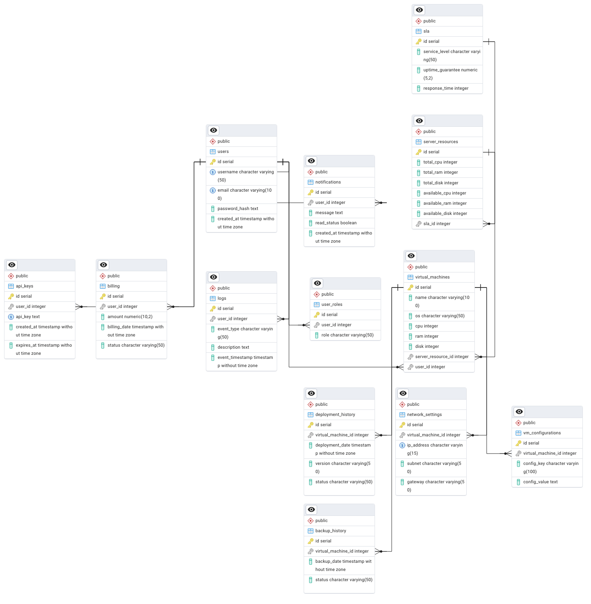

# Schemat bazy danych

## Diagram ERD

## Tabele

### Tabela: `sla`
- **Opis:** Przechowuje informacje o poziomach SLA (Service Level Agreement).
- **Kolumny:**
  - `id` *(serial, PRIMARY KEY)* – unikalny identyfikator SLA.
  - `service_level` *(VARCHAR(50), NOT NULL)* – nazwa poziomu SLA (np. Gold, Silver, Bronze).
  - `uptime_guarantee` *(DECIMAL(5,2), NOT NULL)* – gwarantowany czas działania w procentach (np. 99.99).
  - `response_time` *(INT, NOT NULL)* – gwarantowany czas reakcji w minutach.

---

### Tabela: `server_resources`
- **Opis:** Przechowuje informacje o zasobach serwerowych.
- **Kolumny:**
  - `id` *(serial, PRIMARY KEY)* – unikalny identyfikator serwera.
  - `total_cpu` *(INT, NOT NULL)* – całkowita liczba rdzeni procesora na serwerze.
  - `available_cpu` *(INT, NOT NULL)* – liczba dostępnych rdzeni procesora.
  - `total_ram` *(INT, NOT NULL)* – całkowita ilość pamięci RAM w GB.
  - `available_ram` *(INT, NOT NULL)* – dostępna ilość pamięci RAM w GB.
  - `total_disk` *(INT, NOT NULL)* – całkowita pojemność dysku w GB.
  - `available_disk` *(INT, NOT NULL)* – dostępna pojemność dysku w GB.
  - `sla_id` *(INT, FOREIGN KEY REFERENCES `sla(id)`)* – poziom SLA przypisany do serwera.

---

### Tabela: `virtual_machines`
- **Opis:** Przechowuje informacje o maszynach wirtualnych przypisanych do użytkowników.
- **Kolumny:**
  - `id` *(serial, PRIMARY KEY)* – unikalny identyfikator maszyny wirtualnej.
  - `name` *(VARCHAR(100), NOT NULL)* – nazwa maszyny.
  - `os` *(VARCHAR(50))* – system operacyjny maszyny (np. Ubuntu, Windows).
  - `cpu` *(INT, NOT NULL)* – liczba przydzielonych rdzeni procesora.
  - `ram` *(INT, NOT NULL)* – przydzielona ilość pamięci RAM w GB.
  - `disk` *(INT, NOT NULL)* – przydzielona pojemność dysku w GB.
  - `server_resource_id` *(INT, FOREIGN KEY REFERENCES `server_resources(id)` ON DELETE CASCADE)* – serwer, na którym działa maszyna wirtualna.
  - `user_id` *(INT, FOREIGN KEY REFERENCES `users(id)` ON DELETE SET NULL)* – użytkownik, który zarządza maszyną.

---

### Tabela: `deployment_history`
- **Opis:** Przechowuje historię wdrożeń dla maszyn wirtualnych.
- **Kolumny:**
  - `id` *(serial, PRIMARY KEY)* – unikalny identyfikator wdrożenia.
  - `virtual_machine_id` *(INT, FOREIGN KEY REFERENCES `virtual_machines(id)` ON DELETE CASCADE)* – odniesienie do maszyny wirtualnej.
  - `deployment_date` *(TIMESTAMP, DEFAULT NOW())* – data i czas wdrożenia.
  - `version` *(VARCHAR(50), NOT NULL)* – wersja wdrożonego oprogramowania.
  - `status` *(VARCHAR(50), CHECK (status IN ('success', 'failure')))* – status wdrożenia (np. success, failure).

---

### Tabela: `users`
- **Opis:** Przechowuje informacje o użytkownikach systemu.
- **Kolumny:**
  - `id` *(serial, PRIMARY KEY)* – unikalny identyfikator użytkownika.
  - `username` *(VARCHAR(50), UNIQUE, NOT NULL)* – nazwa użytkownika.
  - `email` *(VARCHAR(100), UNIQUE, NOT NULL)* – adres e-mail użytkownika.
  - `password_hash` *(TEXT, NOT NULL)* – haszowane hasło użytkownika.
  - `created_at` *(TIMESTAMP, DEFAULT NOW())* – data rejestracji użytkownika.

---

### Tabela: `user_roles`
- **Opis:** Określa role użytkowników w systemie.
- **Kolumny:**
  - `id` *(serial, PRIMARY KEY)* – unikalny identyfikator wpisu.
  - `user_id` *(INT, FOREIGN KEY REFERENCES `users(id)` ON DELETE CASCADE)* – użytkownik.
  - `role` *(VARCHAR(50), CHECK (role IN ('admin', 'client')))* – przypisana rola.

---

### Tabela: `logs`
- **Opis:** Rejestruje zdarzenia systemowe.
- **Kolumny:**
  - `id` *(serial, PRIMARY KEY)* – unikalny identyfikator zdarzenia.
  - `user_id` *(INT, FOREIGN KEY REFERENCES `users(id)` ON DELETE SET NULL)* – użytkownik wykonujący operację.
  - `event_type` *(VARCHAR(50), NOT NULL)* – typ zdarzenia.
  - `description` *(TEXT, NOT NULL)* – opis zdarzenia.
  - `event_timestamp` *(TIMESTAMP, DEFAULT NOW())* – czas wystąpienia zdarzenia.

---

### Tabela: `backup_history`
- **Opis:** Przechowuje informacje o kopiach zapasowych maszyn wirtualnych.
- **Kolumny:**
  - `id` *(serial, PRIMARY KEY)* – unikalny identyfikator kopii zapasowej.
  - `virtual_machine_id` *(INT, FOREIGN KEY REFERENCES `virtual_machines(id)` ON DELETE CASCADE)* – maszyna wirtualna, której dotyczy kopia zapasowa.
  - `backup_date` *(TIMESTAMP, DEFAULT NOW())* – data wykonania kopii.
  - `status` *(VARCHAR(50), CHECK (status IN ('completed', 'failed')))* – status kopii zapasowej.

---

### Tabela: `notifications`
- **Opis:** Przechowuje powiadomienia wysyłane do użytkowników.
- **Kolumny:**
  - `id` *(serial, PRIMARY KEY)* – unikalny identyfikator powiadomienia.
  - `user_id` *(INT, FOREIGN KEY REFERENCES `users(id)` ON DELETE CASCADE)* – użytkownik odbierający powiadomienie.
  - `message` *(TEXT, NOT NULL)* – treść powiadomienia.
  - `read_status` *(BOOLEAN, DEFAULT FALSE)* – czy powiadomienie zostało przeczytane.
  - `created_at` *(TIMESTAMP, DEFAULT NOW())* – data wysłania powiadomienia.

---

### Tabela: `billing`
- **Opis:** Przechowuje informacje o rozliczeniach użytkowników.
- **Kolumny:**
  - `id` *(serial, PRIMARY KEY)* – unikalny identyfikator wpisu.
  - `user_id` *(INT, FOREIGN KEY REFERENCES `users(id)` ON DELETE CASCADE)* – użytkownik objęty rozliczeniem.
  - `amount` *(DECIMAL(10,2), NOT NULL)* – kwota rozliczenia.
  - `billing_date` *(TIMESTAMP, DEFAULT NOW())* – data wystawienia rachunku.
  - `status` *(VARCHAR(50), CHECK (status IN ('pending', 'paid', 'failed')))* – status rozliczenia.

---

## Relacje między tabelami
Tabele są ze sobą powiązane za pomocą kluczy obcych. Na przykład:

- **`server_resources` -> `sla`**: wiele serwerów może mieć ten sam poziom SLA.
  - Relacja **N:1** (wiele serwerów przypisanych do jednego poziomu SLA).

- **`virtual_machines` -> `server_resources`**: każda maszyna wirtualna należy do jednego serwera.
  - Relacja **N:1** (wiele maszyn wirtualnych na jednym serwerze).

- **`virtual_machines` -> `users`**: każda maszyna wirtualna jest przypisana do jednego użytkownika.
  - Relacja **N:1** (jeden użytkownik może mieć wiele maszyn wirtualnych).
  - Jeśli użytkownik zostanie usunięty, `user_id` w tabeli `virtual_machines` zostanie ustawione na `NULL`.

- **`deployment_history` -> `virtual_machines`**: każda maszyna wirtualna może mieć wiele wpisów w historii wdrożeń.
  - Relacja **N:1** (wiele wdrożeń dla jednej maszyny).

- **`users` -> `billing`**: użytkownik może mieć wiele wpisów w rozliczeniach.
  - Relacja **N:1** (jeden użytkownik, wiele rozliczeń).

- **`users` -> `notifications`**: użytkownik może otrzymywać wiele powiadomień.
  - Relacja **N:1** (jeden użytkownik, wiele powiadomień).

---
